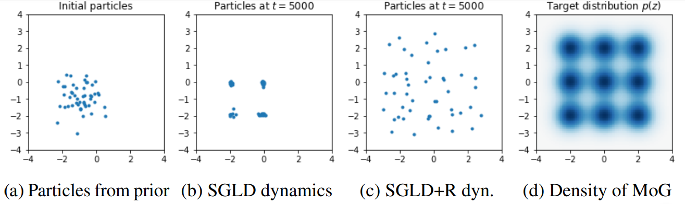
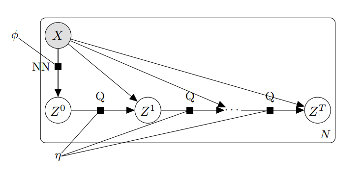
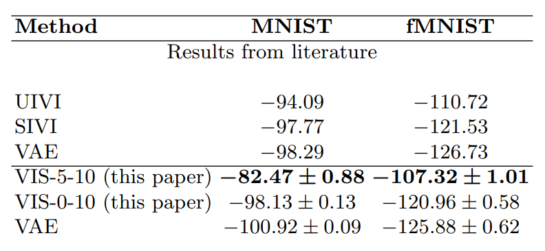

# Intro

* Bayesian inference in deep neural models is **hard**. 

* Traditional MCMC algorithms doesn't scale well (high dimensional data and parameters spaces).

* Two potential topics of interest:

  1. Improve on current Stochastic Gradient MCMC methods.
  
  2. VI+MCMC: automatically tune the sampler parameters (e.g. for faster mixing).

---

# Stochastic Gradient MCMC

* Interested in sampling from a posterior $p(z|x)$ where $x \in \mathbb{R}^d$ are observations and $z \in \mathbb{R}^h$ are latent variables/parameters depending on context.

* Some work in **discretizing a stochastic differential equation** using the Euler-Maruyama scheme

* **Stochastic Gradient Langevin Dynamics** (SGLD) [*Welling and Teh, 2011*]: discretize the Langevin dynamics:

$$z_{t+1} \leftarrow z_{t} - \eta_t \nabla \log p(z_t,x)  + \mathcal{N}(0, 2\eta_t I)$$.

* It's just **SGD + Gaussian noise**: we can minibatch the data.

* Convergence: as long as $\eta_t \rightarrow 0$, no need to perform accept step (the bias can be controlled).

---

# General form for SG-MCMC

* Can we do better than just follow the gradient?

* [*Ma et al, 2015*] introduced the following process:

\begin{equation}
z_{t+1} \leftarrow z_{t} - \epsilon_t \left[ (\mathbf{D}(z_t) + \mathbf{Q}(z_t)) \nabla \log p(z_t, x) + \Gamma(z_t) \right] + \eta_t
\end{equation}

* where we can choose the diffusion $\mathbf{D}(z)$ and curl $\mathbf{Q}(z)$ matrices, for example:

* **SGLD**: $\mathbf{D} = \mathbf{I}$ and $\mathbf{Q} = 0$.
* **Hamiltonian variant (HMC)**:  $\bar{z} = (z, p)$. $\mathbf{D} = 0$ and $\mathbf{Q}=\begin{pmatrix}0 & -\mathbf{I} ;\mathbf{I} & 0\end{pmatrix}$

* Many more samplers: SG-HMC,  SG-Nose-Hoover-Thermostat...

* In practice they mix faster. **Open area**: how to choose the matrices $\mathbf{D}$ and $\mathbf{Q}$ in order to exploit the structure of a deep neural architecture?

---

# Repulsion between chains

* normally one uses $K$ independent chains in parallel

* In *SGMCMC with Repulsive Forces* we propose a diffusion to account for inter-particle effects, so they don't collapse into the same mode:

\begin{align}
z_i^{t+1}  \leftarrow  z_i^t - \epsilon_t \frac{1}{K}\sum_{j=1}^K\big[  k(z_j^t, z_i^t)  \nabla_{z_j^t} \log p(z_j^t) + \nabla_{z_j^t} k(z_j^t, z_i^t)\big] + \xi_i^t
\end{align}

* where $k(z_j, z_i)$ is the Gaussian kernel.

* The previous scheme can be seen as a particular case of the SG-MCMC general form, so **convergence to posterior is guaranteed**.

---

# Review

* Welling, Max and Teh, Yee W. *Bayesian Learning via Stochastic Gradient Langevin Dynamics*. 2011. ICML.

* Ma, Yi-An and Chen, Tianqi and Fox, Emily. *A Complete Recipe for Stochastic Gradient MCMC*. 2015. NIPS.

* Gallego, Victor and Rios Insua, David. *SG-MCMC with Repulsive Forces*. 2018. NIPS Workshop on Bayesian Deep Learning.

* Müller, Peter and Rios Insua, David. *Issues in Bayesian Analysis of Neural Network Models*. 1998. Neural Computation.  (MCMC methods developed for shallow neural nets)

---

# VI + MCMC

* Until now, we have just focused on MCMC techniques. An alternative for deep learning is

* Variational Inference (**VI**):

  * Inference as **optimization**: Minimize divergence $KL(q || p)$ between true posterior $p(z|x)$ and a tractable family $q(z|x)$ (eg: mean field Gaussian).
  
  * SVI: Maximize $\mbox{ELBO}(q) = \mathbb{E}_{q_{\phi}(z|x)} \left[ \log p(x,z) - \log q_{\phi}(z|x)\right]$
  
  * **Problem: bias, underestimation of uncertainty**.
  
* Idea: can we bridge the gap between MCMC and VI?

---

# Variationally Inferred Sampling (VIS)

* **Goal**: propose a variational approximation, that is flexible enough (i.e., the user can control its accuracy by using more computing time).

--

* The **refined variational approximation** is given by

\begin{equation}
q_{\phi,\eta}(z|x) = \int Q_\eta(z|z_0)q_{0,\phi}(z_0|x)dz_0
\end{equation}

where

* $q_{0,\phi} (z | x)$ is the initial and tractable density (diagonal Gaussian).

* $Q_\eta(z|z_0)$ refers to a stochastic process parameterized by $\eta$ used to evolve the original density $q_{0,\phi}(z|x)$.

* Can think of $Q_\eta(z|z_0)$ as $T$ iterations of an MCMC transition kernel.

---

# VIS

Probabilistic graph for the refined variational approximation

* Since the resulting distribution is implicitly defined by the sampler, its density is not available to us.

* $q_{\phi,\eta}(z|x) = \int Q_\eta(z|z_0)q_{0,\phi}(z_0|x)dz_0$ is computed using a finite set of particles (each treated as a Dirac Delta distribution).

---

# Many samplers to choose

As $Q_\eta(z|z_0)$ we can iterate from $i=1$ to $T$ one of the following:

* Stochastic Gradient Descent
\begin{align*}
    z_i &= z_{i-1} + \eta \nabla \log p(x, z_{i-1}),
\end{align*}
  * Stochastic Gradient Descent as Approximate Bayesian Inference [*Mandt et al, 2018*].

* Stochastic Gradient Langevin Dynamics (SGLD)

\begin{align*}
    z_i &= z_{i-1} + \eta \nabla \log p(x, z_{i-1}) + \xi_{i},
\end{align*}

* SGLD + Repulsion : [*Gallego and Rios Insua, 2018*]

\begin{align}
z_i^{t+1}  \leftarrow  z_i^t - \epsilon_t \frac{1}{K}\sum_{j=1}^K\big[  k(z_j^t, z_i^t)  \nabla_{z_j^t} \log p(z_j^t) + \nabla_{z_j^t} k(z_j^t, z_i^t)\big] + \xi_i^t
\end{align}

* Hamiltonian Monte Carlo.

---

# Parameter tuning via AutoDiff

Since we have embedded the sampler inside a variational approximation, we can **optimize wrt the sampler parameters** using autodiff. For instance

* Initial distribution of the sampler:

  * $\nabla_{\phi} \mbox{rELBO}(q)$
  
  * learns good starting points.

* Sampler parameters:

  * $\nabla_{\eta} \mbox{rELBO}(q)$
  
  * For example: in SGLD the learning rate $\eta$ can be dynamically adapted.
  
  * Same for HMC, momentum parameters, etc.

---

# Experiments with VAEs

* Problem: learn a complex, highdimensional data distribution $p(x)$.

* Datasets: MNIST and fashion-MNIST: 60000 28 $\times$ 28 images each.

* Variational autoencoder as the model

  * $p_{\theta}(x|z)$ is a deep neural network (generates the pixels)
  
  * $q_{\phi}(z|x)$ is a diagonal Gaussian whose mean and variance is parameterized by a deep neural network.

* We compare the VIS framework, specifying different values of $T$.

---

# Experiments with VAEs

We report loglikelihood over the test set 

(VIS-X-Y: $T=X$ during learning, $T=Y$ during inference).

* UIVI: Ruiz et al, AISTATS 2019.

* SIVI: Yin et al, ICML 2018.

* Mean times (s) per epoch: 10.30 ( $T=5$ ), 6.52 ( $T=0$ ) (on GPU)

---

# In conclusion

* **VIS** uses variational inference techniques to **speed up a MCMC sampler**.

  * If you prefer, it uses MCMC to make **VI more accurate**.
  
* The user naturally can tradeoff compute for better accuracy.

* Auto tuning of MCMC parameters via autodiff.
  
* Only requires a standard automatic differentiation library, so can be straightforwardly adapted to models that use variable elimination (HMMs, DLMs, ...).

---

# Review

* David M. Blei, Alp Kucukelbir, Jon D. McAuliffe. *Variational Inference: A Review for Statisticians*. 2017. JASA.

* Matthew D Hoffman. *Learning deep latent Gaussian models with Markov chain Monte Carlo*. 2017. ICML.

* Michalis K. Titsias, Francisco J. R. Ruiz. *Unbiased Implicit Variational Inference*. 2019. AISTATS.

* V. Gallego, D. Ríos Insua. *Variationally Inferred Sampling Through a Refined Bound for Probabilistic Programs*. 2019. Under review AISTATS 2020.

---

class: middle, center, inverse

# Thank you!!

victor.gallego@icmat.es

