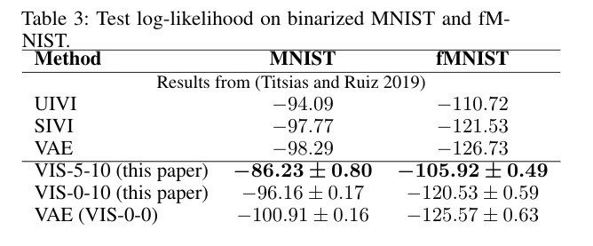

# What is Probabilistic Programming?

* A probabilistic program encodes a probabilistic model using a
specific probabilistic programming language, plus two new operations: **sample** and **condition**.

* Distinction between **model** and **inference**, so we can automatize the following cycle (proposed by Box)

---

# What is Probabilistic Programming?

* A probabilistic program encodes a probabilistic model using a
specific probabilistic programming language, plus two new operations: **sample** and **condition**.

* Distinction between **model** and **inference**.

* Example: a Dynamic Linear Model (DLM):

---

# What is Probabilistic Programming?

* A probabilistic program encodes a probabilistic model using a
specific probabilistic programming language, plus two new operations: **sample** and **condition**.

* Distinction between **model** and **inference**.

* Notation: 

  * $x$ data (observed variables), $z$ latent variables.
  
  * Model specified by $p(z)$ and $p(x|z)$.
  
  * Interested in computing $p(z|x)$.

---

# Why is it useful?

* Increases productivity.

* Example: lines of code comparsion for several models [*source: F. Wood, 2016*].

---

# Main frameworks for inference

* Markov Chain Monte Carlo (**MCMC**):

  * Inference as **sampling**: Markov chain towards posterior distribution in the limit.
  
  * Problem: scalability, slow mixing.
  
  * SGLD [*Welling and Teh, 2011*]: $z_{t+1} \leftarrow z_{t} - \eta_t \nabla \log p(z_t,x)  + \mathcal{N}(0, 2\eta_t I)$.
  
  * SGLD+R [*Gallego and Rios Insua, 2018*]: add interaction term to speed up mixing.

--

* Variational Inference (**VI**):

  * Inference as **optimization**: Minimize divergence $KL(q || p)$ between true posterior $p(z|x)$ and a tractable family $q(z|x)$ (eg: mean field Gaussian).
  
  * SVI: Maximize $\mbox{ELBO}(q) = \mathbb{E}_{q_{\phi}(z|x)} \left[ \log p(x,z) - \log q_{\phi}(z|x)\right]$
  
  * Problem: bias, underestimation of uncertainty.

---

# Main contribution: VIS

* **Goal**: propose a variational approximation, that is flexible enough (i.e., the user can control its accuracy by using more computing time).

--

* The **refined variational approximation** is given by

\begin{equation}
q_{\phi,\eta}(z|x) = \int Q_\eta(z|z_0)q_{0,\phi}(z_0|x)dz_0
\end{equation}

where

* $q_{0,\phi} (z | x)$ is the initial and tractable density (diagonal Gaussian).

* $Q_\eta(z|z_0)$ refers to a stochastic process parameterized by $\eta$ used to evolve the original density $q_{0,\phi}(z|x)$.

* Can think of $Q_\eta(z|z_0)$ as $T$ iterations of an MCMC transition kernel.

---

# VIS

Probabilistic graph for the refined variational approximation

* Since the resulting distribution is implicitly defined by the sampler, its density is not available to us.

* $q_{\phi,\eta}(z|x) = \int Q_\eta(z|z_0)q_{0,\phi}(z_0|x)dz_0$ is computed using a finite set of particles (each treated as a Dirac Delta distribution).

---

# Many samplers to choose

As $Q_\eta(z|z_0)$ we can iterate from $i=1$ to $T$ one of the following:

* Stochastic Gradient Descent
\begin{align*}
    z_i &= z_{i-1} + \eta \nabla \log p(x, z_{i-1}),
\end{align*}
  * Stochastic Gradient Descent as Approximate Bayesian Inference [*Mandt et al, 2018*].

* Stochastic Gradient Langevin Dynamics (SGLD)

\begin{align*}
    z_i &= z_{i-1} + \eta \nabla \log p(x, z_{i-1}) + \xi_{i},
\end{align*}

* Stein Variational Gradient Descent: [*Liu and Wang, 2016; Gallego and Rios Insua, 2018*]

\begin{align}
z_i^{t+1}  \leftarrow  z_i^t - \epsilon_t \frac{1}{K}\sum_{j=1}^K\big[  k(z_j^t, z_i^t)  \nabla_{z_j^t} \log p(z_j^t) + \nabla_{z_j^t} k(z_j^t, z_i^t)\big] + \xi_i^t
\end{align}

* Hamiltonian Monte Carlo.

---

# Rewriting the ELBO

* Performing variational inference with the refined variational approximation can be regarded as just using the original variational guide while optimizing an alternative, tighter ELBO.

--

* Particular case: 1 particle, 1 iteration, the refined variational approximation is $q(z|z_0)q_0(z_0|x)$.

* The ELBO is now

$$
\mathbb{E}_{q(z|z_0)q_0(z_0|x)} \left[ \log p(x, z) - \log q(z|z_0) - \log q_0(z_0 | x)\right].
$$
* Using the Dirac Delta approximation for $q(z|z_0)$ and noting that $z = z_0 + \eta \nabla \log p(x,z_0)$ when using SGD with $T=1$, we arrive at

$$
 \mathbb{E}_{q_0(z_0|x)} \left[ \log p(x, z_0 + \eta \nabla \log p(x,z_0) ) - \log q_0(z_0 | x)\right] =: \mbox{rELBO}(q),
$$

* $\mbox{ELBO}(q_0) \leq \mbox{rELBO}(q)$  (so we optimize a better bound)

---

# Parameter tuning via AutoDiff

Since we have embedded the sampler inside a variational approximation, we can **optimize wrt the sampler parameters** using autodiff. For instance

* Initial distribution of the sampler:

  * $\nabla_{\phi} \mbox{rELBO}(q)$
  
  * learns good starting points.

* Sampler parameters:

  * $\nabla_{\eta} \mbox{rELBO}(q)$
  
  * For example: in SGLD the learning rate $\eta$ can be dynamically adapted.
  
  * Same for HMC, momentum parameters, etc.

---

# Application to BISP

The previous framework is particularly useful in large families of state-space models
\begin{align*}
    z_{t+1} &\sim p(z_{t+1} | z_t, \theta) \\
    x_{t+1} &\sim p(x_{t+1} | z_{t+1}, \theta)
\end{align*}
mainly through two complementary strategies:

* Variable elimination of some particular terms (**sum-product**).

* Exact computation in linear cases.

--

After the initial variational approximation $q(\theta)$ we would refine with
\begin{equation}
\theta \leftarrow \theta + \nabla_{\theta} \log p(x_{1:T}|z_{1:T},\theta) + \xi.
\end{equation}
but we can perform variable elimination and use (lower variance):
\begin{equation}
\theta \leftarrow \theta + \nabla_{\theta} \log p(x_{1:T}|\theta) + \xi.
\end{equation}

---

# Experiments with HMMs

We fit the following model to synthetic datasets:

* Hidden Markov Model (HMM): 

\begin{equation}
p(z_{1:T} , x_{1:T}, \theta) = \prod_{t=1}^T p(x_t|z_t,\theta)p(z_t|z_{t-1},\theta)p(\theta).
\end{equation}

---

# Experiments with HMMs

* Results for 100 different random seeds for each VIS configuration ( $T= 0, 1, 2$ )

--

* Mean time (s) per iteration: 0.018 ( $T=0$ ), 0.029 ( $T=1$ ), 0.045 ( $T=2$ ) (on CPU).

---

# Application to VAEs

## Amortized inference

* Suppose the user needs to approximate the posterior $p(z | x)$ at different $x_1, x_2, ...$ (e.g. clustering of samples $x_i$)

* Using just an MCMC is very costly: re-run the chain(s) for each $p(z | x_i)$.

* By using an approximation of the form $q(z | x)$ we can map $x$ values to latent values $z$.

--

* Variational Autoencoder (VAE) framework [*Kingma and Welling, 2013*]:

  * Want to learn the data distribution $p(x)$ (i.e., for generating new images, outlier detection..).
  
  * Jointly learn the model $p_{\theta}(x|z)p(z)$ and a variational approximation $q_{\phi}(z | x)$. 

* VIS: refine $q_{\phi}(z | x)$ with a (very) small amount of MCMC steps.

---

# Experiments with VAEs

* Problem: learn a complex, highdimensional data distribution $p(x)$.

* Datasets: MNIST and fashion-MNIST: 60000 28 $\times$ 28 images each.

* Variational autoencoder as the model

  * $p_{\theta}(x|z)$ is a deep neural network (generates the pixels)
  
  * $q_{\phi}(z|x)$ is a diagonal Gaussian whose mean and variance is parameterized by a deep neural network.

* We compare the VIS framework, specifying different values of $T$.

---

# Experiments with VAEs

We report loglikelihood over the test set 

(VIS-X-Y: $T=X$ during learning, $T=Y$ during inference).

* UIVI: Ruiz et al, AISTATS 2019.

* SIVI: Yin et al, ICML 2018.

* Mean times (s) per epoch: 10.30 ( $T=5$ ), 6.52 ( $T=0$ ) (on GPU)

---

# On-going work

* Use a gradient estimator, instead of the Delta approximation.

* Discrete variables, for full generalization

  * Perform autodiff through a continuous relaxation of the Categorical distribution.

* Better assessment of uncertainty quality: **scoring rules**.

---

# In conclusion

* **VIS** uses variational inference techniques to **speed up a MCMC sampler**.

  * If you prefer, it uses MCMC to make **VI more accurate**.
  
* The user naturally can tradeoff compute for better accuracy.

* Auto tuning of MCMC parameters via autodiff.
  
* Only requires a standard automatic differentiation library, so can be straightforwardly adapted to models that use variable elimination (HMMs, DLMs, ...).

---

class: middle, center, inverse

# Thank you!!

victor.gallego@icmat.es

